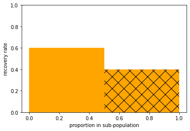

# simpson-reversals

Generates and visualizes indefinitely many Simpson reversals.

For example:

A Simpson reversal is when an association between two variables changes sign when you condition on the value of a third variable, no matter what the value of the third variable is. For example, in a drug trial, the recovery rate is higher in the treatment group than the control group overall, but lower among men *and* lower among women.

In fact, you can get indefinitely many Simpson reversals. For example, comparing treatment group and control group, there might be:
  - overall, a lower recovery rate
  - in each of two sub-populations, a higher recovery rate
  - in each of four sub-sub-populations, a lower recovery rate
  - in each of eight sub-sub-sub-populations, a higher recovery rate
  - and so on.

The function simpson_tree generates an example of k reversals, for any k. The function draw_layers visualizes each layer: e.g. the recovery rates in the relevant populations, across treatment and control groups. And the function to_data generates and prints count data corresponding to a given Simpson tree.

For more explanation see the accompanying jupyter notebook.