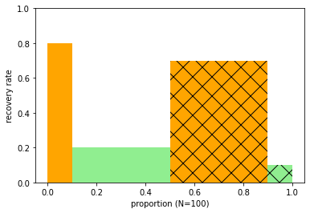
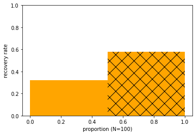
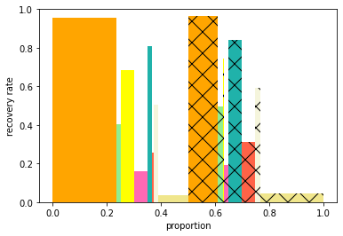
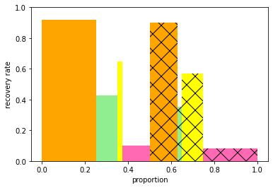
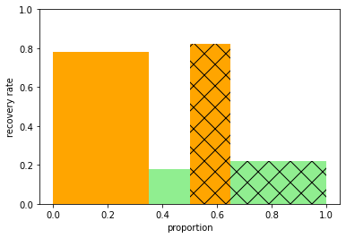
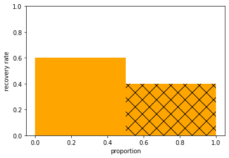
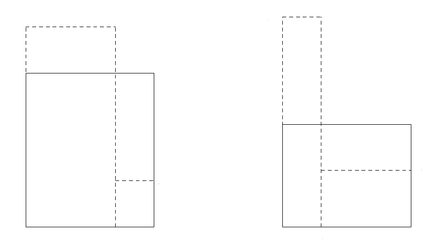
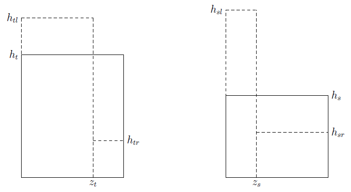
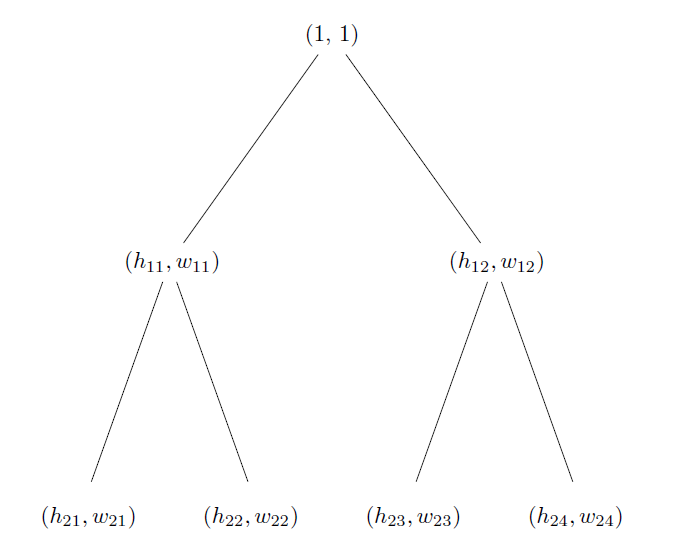

# README

The module `simpson_reversals.py` provides functions to generate and visualize indefinitely many Simpson reversals.

This README explains what Simpson reversals are, then how the functions work.

## 1. What are Simpson reversals?

### 1.1 Drug trial

For concreteness I'll focus on an imaginary drug trial.

To assess the effectiveness of a drug, we give some patients ("the treatment group") the drug and other patients ("the control group") a placebo, and look at the recovery rates.

The idea is: if the recovery rate is higher in the treatment group than the control group, that's evidence the drug is good; if the recovery rate is lower in the treatment group than the control group, that's evidence the drug is bad.

The table shows the results:

|                | men in treatment group | women in treatment group | men in control group | women in control group |
|----------------|:----------------------:|:------------------------:|:--------------------:|:----------------------:|
|    recovered   |            8           |             8            |          28          |            1           |
| didn't recover |            2           |            32            |          12          |            9           |

### 1.2 Visualizing the results

The table isn't easy to take in at a glance: too many categories, too many numbers. Let's use a picture instead.

<p align="center">

</p>

How to interpret the picture?

Focus, for example, on the unhatched orange column. It corresponds to men in the treatment group. Its *width* is the proportion of patients who are men in the treatment group: 10 out of 100, or .1. Its *height* is the recovery rate of men in the treatment group: 8 out of 10, or .8. Its area, therefore, is the proportion of patients who are men in the treatment group and who recovered: 8 out of 100, or .08.

And similarly for the other columns: orange for men and green for women; unhatched for treatment group and hatched for control group.

### 1.3 Three observations

*First observation.* The unhatched orange column is taller than the hatched orange column, or in other words, the recovery rate of men in the treatment group is higher than of men in the control group.

*Second observation.* The unhatched green column is taller than the hatched green column, or in other words, the recovery rate of women in the treatment group is higher than of women in the control group.

*Third observation.* Let's compare the recovery rates, not of men, not of women, but of *people*: the recovery rate of people in the treatment group versus people in the control group.

Those recovery rates are not directly represented in the picture. There's a column for men in the treatment group, and a column for women in the treatment group, but no column for people in the treatment group. And similarly for the control group. So we need to work out the new columns ourselves.

Representing the results using the picture makes it easy to work out the new columns. There's a simple trick to it. The trick is: *merge columns like water*.

For example, take the treatment group. The trick is to imagine that the two unhatched columns are columns of water with a barrier between them. To merge the columns, remove the barrier and let the water slosh together. At what height will it settle? Around .3. That column is what we're after: its *width* is the proportion of people who are in the treatment group; its *height* is the recovery rate of people in the treatment group.

Similarly for the control group. Imagine the two hatched columns are columns of water with a barrier between them. Remove the barrier and let the water slosh together. At what height will it settle? Around .6. That column is what we're after: its *width* is the proportion of people who are in the control group; its *height* is the recovery rate of people in the control group.

Let's check:

<p align="center">

</p>

We were about right: the recovery rate in the treatment group is around .3 and in the control group is around .6.

We can use our physical intuition, about merging columns of water, to move from the first picture, representing the segregrated data, to the second picture, representing the aggregated data.

So the third observation, at last, is that the recovery rate of people in the treatment group is lower than of people in the control group.

### 1.4 Why the trick works

Take the treatment group, for example.

The proportion of patients who are in the treatment group equals the proportion of patients who are men in the treatment group plus the proportion of patients who are women in the treatment group. In other words, when merging the columns total width is preserved.

The proportion of patients who are in the treatment group and who recovered equals the proportion of patients who are men in the treatment group and who recovered plus the proportion of patients who are women in the treatment group and who recovered. In other words, when merging the columns total area is preserved.

When merging columns, total width is preserved and total area is preserved. That's how columns of water behave. So that's why we can merge columns like water.

### 1.5 Why Simpson reversals matter

Remember our three observations: comparing treatment and control group, the recovery rate is *higher* among men, *higher* among women, but *lower* among people. This phenomenon is known as a Simpson reversal.

When our data exhibit a Simpson reversal, what to conclude?

We could go by the recovery rates among people (lower in treatment than control group), concluding that the drug is bad. Or we could go by the recovery rates among men and among women (higher in treatment than control groups), concluding that the drug is good.

Judea Pearl has argued that the answer cannot be determined from the data alone, but depends in addition on the *causal story* behind the data. This debate is what makes Simpson reversals particularly interesting.

### 1.6 Multiple Simpson reversals

Data could exhibit not just one but indefinitely many Simpson reversals.

For example, comparing treatment group and control group, there might be:

  - overall, a *higher* recovery rate
  - for men and for women, *lower* recovery rates
  - for men over 50, men under 50, women over 50, and women under 50, *higher* recovery rates
  - for men over 50 with a comorbidity, men over 50 without a comorbidity, men under 50 with a comorbidity, ..., women under 50 without a combordity, *lower* recovery rates
  - and so on.

Let's visualize it.

For men over 50 with a comorbidity, men over 50 without a comorbidity, men under 50 with a comorbidity, ..., women under 50 without a combordity, *lower* recovery rates**:

<p align="center">

</p>

Merge columns like water: first and second, third and fourth, fifth and sixth, and so on. Thus for men over 50, men under 50, women over 50, and women under 50, *higher* recovery rates:

<p align="center">

</p>

Merge columns like water again. Thus for men and for women, *lower* recovery rates:

<p align="center">

</p>

Merge columns like water once more. Thus overall, a *higher* recovery rate:

<p align="center">

</p>

### 1.7 What's driving the reversals

<p align="center">

</p>

The dashed columns on the left are shorter than their counterparts on the right. But what will happen when we merge them?

Take the dashed columns on the left. One is tall and wide. The other is short and narrow. When we merge them, the wide one dominates. So the resulting column&mdash;the solid lines&mdash;is quite tall.

Now take the dashed columns on the right. One is tall and narrow. The other is short and wide. When we merge them, the wide one dominates. So the resulting column is quite short.

That is what drives a Simpson reversal: tall-wide and short-narrow versus tall-narrow and short-wide.

## 2. Making the pictures

### 2.1 Usage

The main function is `draw_layers()`.

```
first_layer = [[(30/50, 50/100)], [(20/50, 50/100)]]
draw_layers(first_layer, 4)
```

The user specifies the heights and widths of the columns representing treatment and control groups. It assumes the first column is taller. No loss of generality, since you can reinterpret unhatched as control group and hatched as treatment group.) The function `draw_layers()` generates the specified number of Simpson reversals and creates matplotlib figures, similar to those above, to visualize each reversal.

You can also just draw a particular layer, using `draw_layer()`.

### 2.2 Recipe

How are the reversals generated?

The *merge like water* trick takes segregated data and returns aggregated data. To generate Simpson reverals, we need to do the opposite: take aggregated data and return segegated data.

More exactly, given two columns, possibly of different widths and heights, we need to split each in two such that 

  1. the widths of the two children sum to the width of the parent
  2. the areas of the two children sum to the area of the parent
  3. the taller column yields the shorter children
  
Remember the picture from before:

<p align="center">

</p>

The original columns are shown by the solid lines. The desired new columns are shown by the dashed lines. We need to find suitable values for h_{tl}, z_t, h_{tr} and h_{sl}, z_s, h_{sr}.

We take z_t to be a proportion of the original left column's width, so is in (0, 1), and similarly for z_s. And we take all the heights to be in (0, 1) too.

For any *a* < *b*, *c* < *d*, all between 0 and 1, we can set:

  1. h_{tl} = h_t + *a*(1 - h_t)
  2. h_{sl} = h_t + *b*(1 - h_t)
  3. h_{tr} = *c*h_s
  4. h_{sr} = *d*h_s
  
Because we need to preserve areas, we must have:

  5. h_t = h_{tl} \* z_b + h_{tr} \* (1 - z_t)
  6. h_s = h_{sl} \* z_s + h_{sr} \* (1 - z_s)

Substituting 1-4 into 5 and 6 and re-arranging yields:

  7. z_t = (h_t - *c*h_s) / ((1 - *a*)h_t + *a* - *c*h_s)
  
and 

  8. z_s = (h_s - *d*h_s) / ((1 - *b*)h_t + *b* - *d*h_s)
  
The code above splits each pair of columns, one from the treatment group and one from the control group, according to this recipe.

I chose particular values of the free parameters *a*, *b*, *c*, *d* somewhat arbitrarily. You can change them if you like. You could even change them from pair of columns to pair of columns, to get finer control, though that would require a bit more work.

It may help to picture a *Simpson tree*, of which a few layers are shown here:

<p align="center">

</p>

In general, a Simpson tree is an infinite binary tree at each node of which lives a column, represented by a tuple of its height and width. At the root node lives (1, 1), representing the entire population. It has two children, specified manually, representing the recovery rates and sizes of the treatment and control groups. Subsequent layers in the tree are generated on demand according to the recipe above, getting a Simpson reversal from each layer to the next.